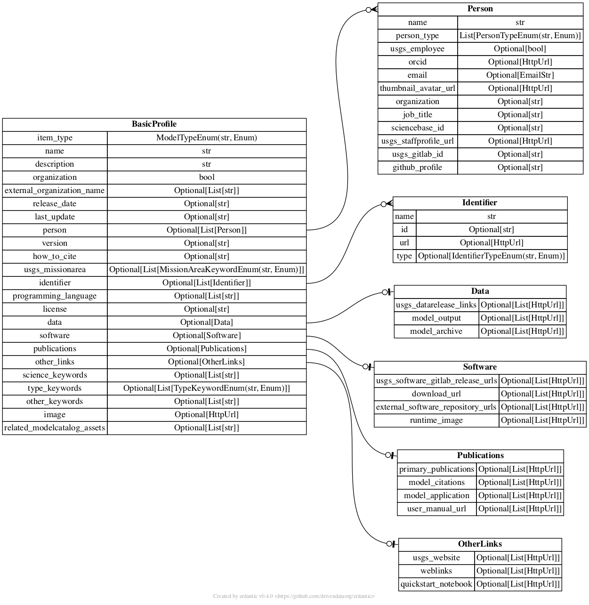

# tam

   

*USGS Model Catalog Tools and Metadata*

This repo contains information, tools and metadata schemas for the USGS Model Catalog.

## Versioning

Schema versioning can be found as a private model attribute within each schema as `model._version` and will follow semver standards (major.minor.patch)

## Provisional Software Statement

Under USGS Software Release Policy, the software codes here are considered preliminary, not released officially, and posted to this repo for informal sharing among colleagues.

This software is preliminary or provisional and is subject to revision. It is being provided to meet the need for timely best science. The software has not received final approval by the U.S. Geological Survey (USGS). No warranty, expressed or implied, is made by the USGS or the U.S. Government as to the functionality of the software and related material nor shall the fact of release constitute any such warranty. The software is provided on the condition that neither the USGS nor the U.S. Government shall be held liable for any damages resulting from the authorized or unauthorized use of the software.